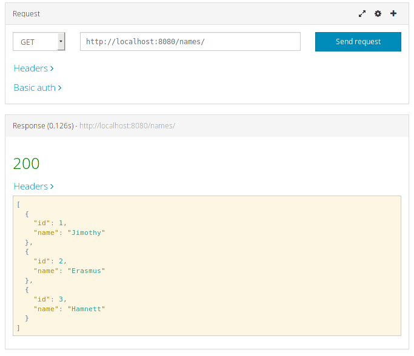
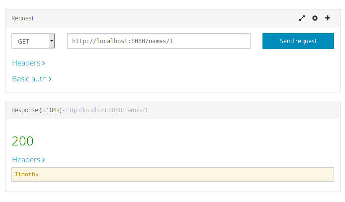
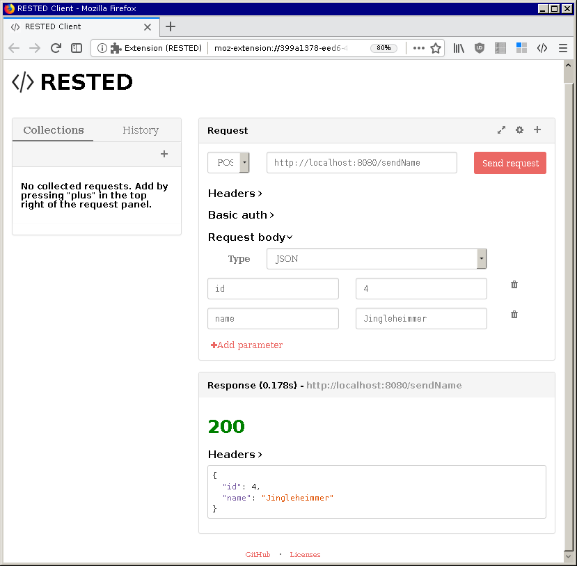
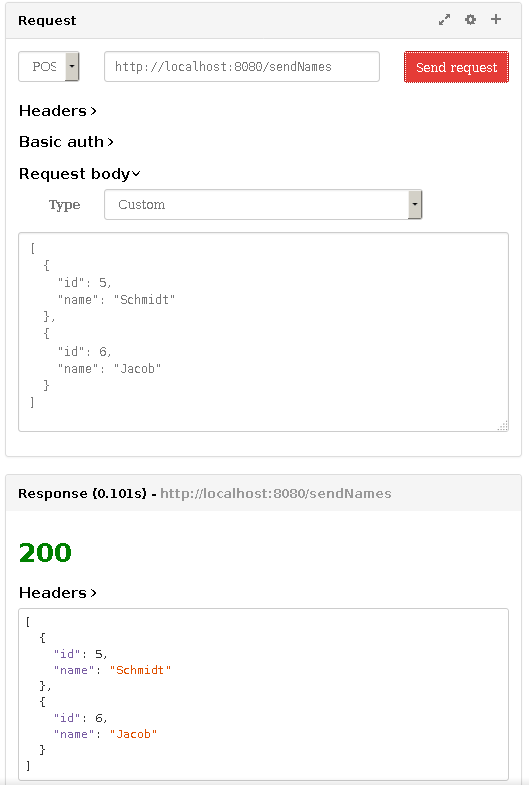
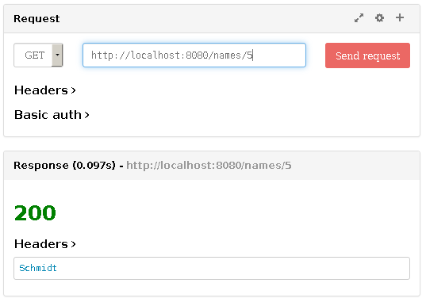
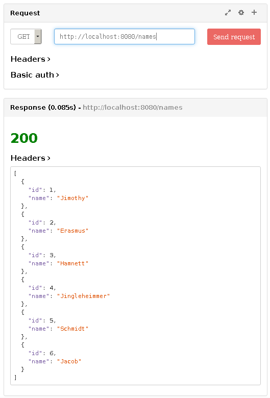

REST Assignment #1
==================

> In this assignment you will be using Java Spring to begin working on
> a RESTful server.  For this assignment you will be a RESTful service
> to return a single String and also an array of String.  You must
> submit three Java files, the xxxApplication file, the xxxController
> and the Name class.  In the previous sentence, xxx is replaced with
> your choice of what you want to call the file/project.  The
> xxxApplication file is generated by IntelliJ. You must write the
> Controller with the appropriate methods.  This controller and its
> methpods must have the proper annotations to allow the server to
> function properly.
>
> The Name class needs to provide instance variables for the ID and
> name. ID will be an int and name a String.  Provide getters, setters
> and a no argument and two argument constructor.
>
> In the controller, you will be doing is writing two methods,
> getNames which will return a List of Name objects.  Second you will
> write a getName method which will take an int for the id and return
> the String for the associated Name object.  The getNames method
> should use an extension to the URI of names.  The getName method
> should use this same URI with addition of the id for the name that
> you want to retrieve, investigate the PathVariable annotation.
> Recommend in the controller that you initialize a list of Name
> objects, the name should be unique for each object.
>
> Your submission should include the following Java files,
> Application, Controller and Name.  Also you must include screenshots
> of your ARC or Postman results, one showing the list of names and
> one showing the single name.

In Action
---------

REST Assignment #2
==================

> In this assignment, we will be adding the handling of POST messages
> to our RESTful server.  Begin with the `NamesController`, or
> whatever you called your project created in REST 1. To this we will
> add a couple of methods to handle POST messages. Depending on your
> implementation for REST 1, you may have to modify your code to store
> a `List<Name>` of the original Name object you created in
> REST 1. You will add the new object to this `List`. Your choice on
> what type of `List` data structure you would like to use.
>
> You will need to write two methods, one accepts a single `Name`
> object and one to accept a `List` of Name objects. These will both
> use JSON to send the Name object(s) to the server. This will require
> you to create JSON in ARC to send to the server. The method,
> createName should add the Name object to the `List` on the server
> side and update the ID appropriately. This should return the Name
> object that has been added to the `List`. To test, you should then
> use your get method to retrieve all `Name` objects and ensure that
> your new Name object is stored in the List.  For the second method,
> you will be sending a `List<Name>` to the server. These `Name`
> objects should have their ID adjusted and be stored in your
> `List`. Again, when you have executed this, you should retrieve the
> entire list and display the `Name` objects from the `List` in the
> ARC.  Finally, use your GET method to retrieve a `Name` object that
> you added when you sent your `List`.

In Action
---------

